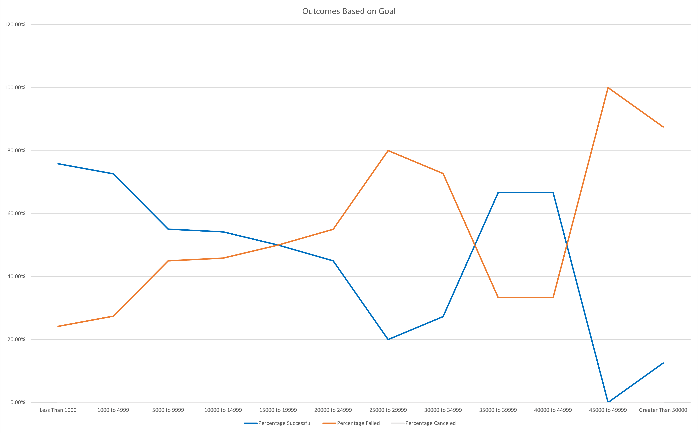

# Kickstarting with Excel

## Overview of Project
My client Louise has requested an analysis of the launch dates versus funding goals for the Kickstarter play campaigns. Using Microsoft Excel, I have prepared two deliverables consisting of tables and charts to share my findings.
### Purpose
The purpose of the analysis is to inform Louise's potential future Kickstarter campaigns. Using the findings from this report, Louise can set her campaign launch dates and fundraising goals based on the most successful Kickstarter campaigns.

## Analysis and Challenges

### Analysis of Outcomes Based on Launch Date
Please see the line graph below for findings of Theater Outcomes Based on Launch Date. 

The blue line for successful theater campaigns shows a clear peak in May, with a steady decline in June to December. Overall the spring and summer months trend higher than the winter and fall months, with the maximum value of 111 campaigns in May and the minimum value of 37 campaigns in December.

The red line for failed theater campaigns is fairly consistent across all months within a range of about 30 to 50 campaigns, suggesting that the launch date may not have been the most important contributing factor to the failure of the campaigns.

The yellow line for for canceled theater campaigns is very flat, also suggesting that the launch date may not have been the most important contributing factor to the cancellation of the campaigns.

### Analysis of Outcomes Based on Goals
Please see the line graph below for findings of Play Outcomes Based on Goals.

The blue line for percentage successful play campaigns and the yellow line for percentage failed play campaigns mirror each other, showing an inverse relationship.

The percentage successful is highest for goals less than 1000 at about 75%, and steadily declines to about 20% between 25000 to 29999. The next upward trend plateaus at about 65% for 35000 to 39999 and 40000 to 44999, with a deep decline to less than 15% for 45000 to 49999 and greater than 50000. This suggests that the low range goals, under 1000 and 20000 to 24999, and the mid-upper range goals, 35000 to 49999, provide the best chances for a successful campaign.

The percentage failed clearly shows that the upper range goals, 45000 to greater than 50000, provide the highest chance of a failed campaign with nearly 90-100% failing. Exactly mid-range goals, 25000 to 29999, also have a high rate of failure at about 80%.

### Challenges and Difficulties Encountered
I encountered difficulties with the Year function outputting "1900" instead of the correct year from the Date Created Conversation column. The solution was clearing the cells and retyping the function, which then provided the correct output values. The COUNTIFS function was also challenging, since some goals were in ranges that required mulitple conditions for the same column range. I found the video very helpful and was able to enter everything correctly so that the function outputted the correct values.

## Results

- What are two conclusions you can draw about the Outcomes based on Launch Date?
1. The best month range to launch a successful theater campaign is April to August, with May, June, and July as the top three months to launch a successful Kickstarter play campaign. 
2. The launch date does not appear to be the most important contributing factor for failed and cancelled theater campaigns. 

- What can you conclude about the Outcomes based on Goals?
1. Goals are a strong indicator of the play campaign's outcome, and upper range goals greater than 45000 almost always fail and should be avoided.
- What are some limitations of this dataset?
My deliverables are separately analyzing a parent category, theater, and a sub category, plays. My client has shown interest in using Kickstarter for the broader theater category and not just plays, but I need to provide further analysis for other sub categories she may be pursuing that are not plays. This dataset also did not contain any cancelled play campaigns, so my analysis cannot provide recommendations for that outcome. 
- What are some other possible tables and/or graphs that we could create?
A measure of central tendency and graph would also be helpful for my client to visualize successful vs failed campaigns. In this case, identifying the median and creating a box and whisker plot would be most helpful to show the inner-quartile range of successful campaigns and the outliers.
